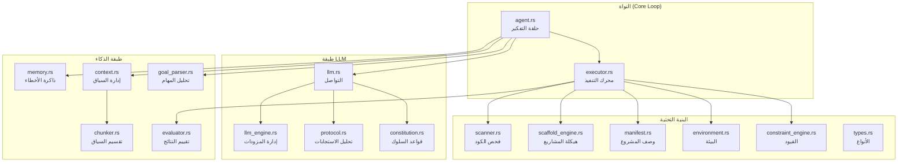
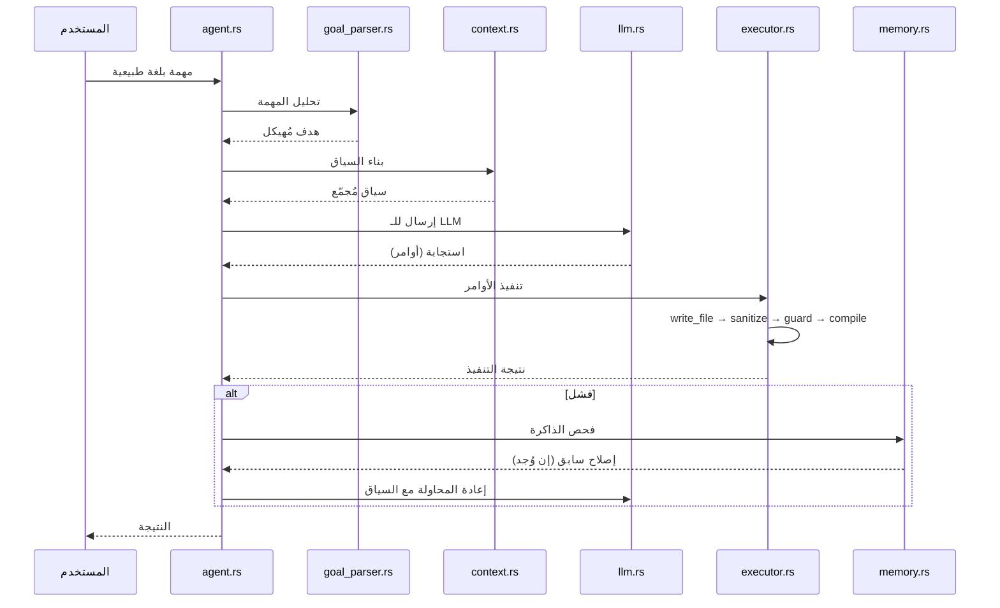
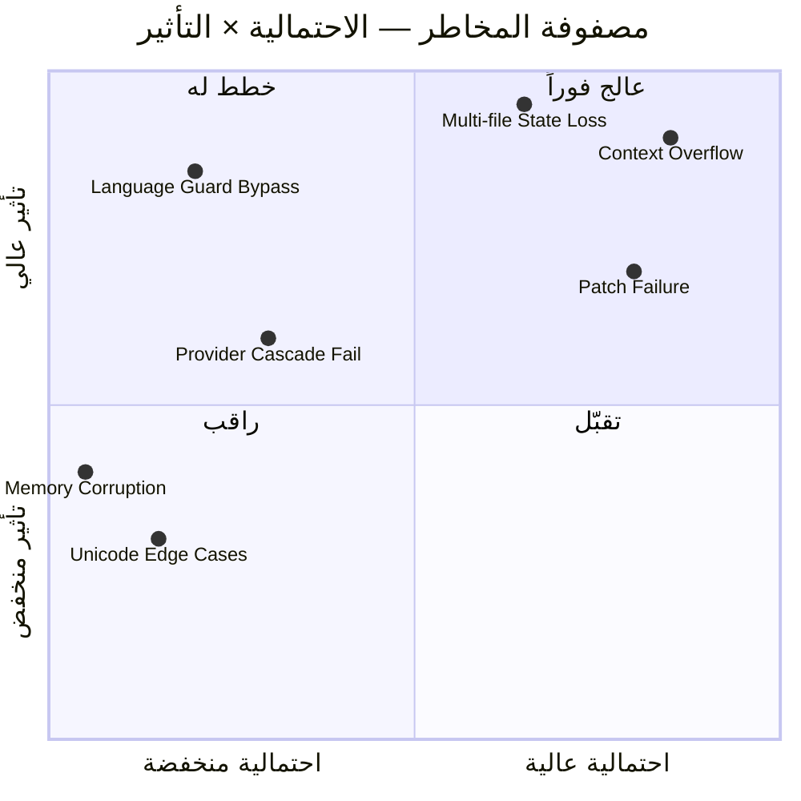
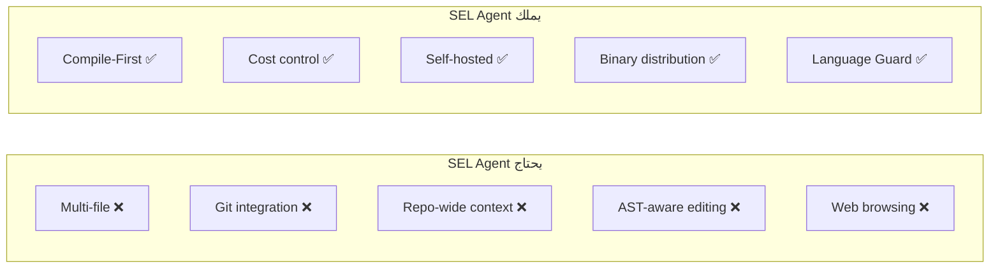
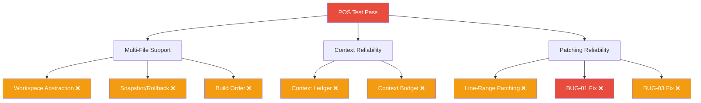

# SEL Agent v7.3.0 — تقرير المراجعة التقنية الشاملة

> **المراجع:** مهندس برمجيات أول — أنظمة ذكاء اصطناعي ومعماريات برمجية
> **التاريخ:** 2026-04-17
> **النسخة المُراجَعة:** v7.3.0
> **التقييم العام:** ⚠️ مشروع واعد بأساسات سليمة، لكنه يحتاج استثمارات هيكلية قبل التوسع

---

## الفهرس

1. [تقييم المعمارية العامة](#1-تقييم-المعمارية-العامة)
2. [تقييم القرارات التقنية](#2-تقييم-القرارات-التقنية)
3. [تحليل الثغرات والمخاطر](#3-تحليل-الثغرات-والمخاطر)
4. [تقييم خارطة الطريق](#4-تقييم-خارطة-الطريق)
5. [توصيات الأولوية](#5-توصيات-الأولوية)
6. [تقييم جودة الكود](#6-تقييم-جودة-الكود)
7. [مقارنة بالمعايير الصناعية](#7-مقارنة-بالمعايير-الصناعية)
8. [الخلاصة التنفيذية](#8-الخلاصة-التنفيذية)

---

## 1. تقييم المعمارية العامة

### 1.1 التقسيم بين الملفات



#### التقييم:

| المعيار | التقييم | التفصيل |
|---------|---------|---------|
| فصل المسؤوليات (SRP) | ✅ صواب | كل ملف له مسؤولية واضحة ومحددة |
| التماسك الداخلي (Cohesion) | ✅ صواب | الملفات مجمّعة حسب الوظيفة بشكل منطقي |
| الارتباط (Coupling) | ⚠️ مقبول | `executor.rs` يعاني من coupling مرتفع — سأفصّل لاحقاً |
| قابلية التوسع | ⚠️ مقبول | التصميم الحالي يعمل لملف واحد، لكنه سيحتاج إعادة هيكلة جوهرية للـ multi-file |
| العمق (Depth) | ✅ صواب | 3 طبقات واضحة: Core → Intelligence → Infrastructure |

#### النقد التفصيلي:

**✅ ما هو سليم:**
- التقسيم إلى `agent.rs` (ماذا يفعل) و `executor.rs` (كيف يفعل) ممتاز — هذا نمط **Orchestrator-Worker** كلاسيكي وسليم
- فصل `llm.rs` عن `llm_engine.rs` قرار ذكي — يفصل بين "كيف أتحدث مع LLM" و"أي LLM أختار ومتى"
- `constitution.rs` كملف مستقل = مصدر حقيقة واحد (Single Source of Truth) — ممتاز

**⚠️ مشكلة Coupling في executor.rs:**

`executor.rs` هو نقطة الضعف المعمارية الأولى. بحسب الوصف، يتولى:
- كتابة الملفات (`write_file`)
- تعديل الملفات (`patch_file`)
- تشغيل الاختبارات (`run_tests`)
- فحص اللغة (Language Guard)
- فحص الترجمة (compile_check)
- تنظيف الكود (sanitize_code)
- إصلاح imports تلقائياً (AutoFix Go)

> [!WARNING]
> هذا **God Object** مصغّر. كل وظيفة إضافية (Snapshot، Line-Range Patching، Multi-File) ستزيد من تعقيده بشكل أُسّي.

**التوصية:**
```
executor.rs → تقسيمه إلى:
├── file_ops.rs        # write_file + patch_file + sanitize
├── compile_check.rs   # فحص الترجمة لكل لغة
├── language_guard.rs  # Language Guard (مستقل وقابل للاختبار)
├── test_runner.rs     # تشغيل الاختبارات + تقييم النتائج
└── autofix.rs         # إصلاحات تلقائية (Go imports وغيرها)
```

**⚠️ غياب طبقة Workspace Abstraction:**

لا يوجد كيان موحّد يمثّل "المشروع" كوحدة. حالياً كل عملية تتعامل مع الملفات مباشرة. هذا سينكسر حتماً عند multi-file لأنك تحتاج:
- تتبع الملفات المعدّلة (dirty tracking)
- ترتيب الترجمة (build order)
- Rollback ذري لمجموعة ملفات

**التوصية:** إنشاء `workspace.rs` يكون هو الوسيط بين executor والنظام الملفاتي — **قبل** البدء بـ multi-file.

---

### 1.2 تدفق البيانات (Data Flow)



**التقييم:** ✅ التدفق منطقي ونظيف. حلقة Think→Act→Observe→Fix هي النمط القياسي في الصناعة (OODA Loop).

**نقطة مفقودة:** لا يوجد **Reflection** خطوة مستقلة — أي لحظة يقف فيها الوكيل ليسأل "هل أنا على المسار الصحيح؟" بدلاً من مجرد "هل الكود يترجم؟". هذا سيكون حرجاً في المهام المعقدة.

---

## 2. تقييم القرارات التقنية

### 2.1 Rust كلغة للوكيل

| المعيار | التقييم | التعليق |
|---------|---------|---------|
| الأداء | ✅ صواب | سرعة التنفيذ ممتازة، لكنها ليست عنق الزجاجة — LLM latency هي المحدد |
| الأمان (Memory Safety) | ✅ صواب | Rust يزيل فئة كاملة من الأخطاء |
| سرعة التطوير | ❌ خطأ | Rust يُبطئ التطوير 3-5× مقارنة بـ Python/TypeScript في هذا النوع من المشاريع |
| النظام البيئي | ⚠️ مقبول | مكتبات LLM في Rust أقل نضجاً من Python |
| التوظيف والمساهمة | ❌ خطأ | مجتمع Rust أصغر بكثير — صعوبة في جذب مساهمين |
| التوزيع | ✅ صواب | Binary واحد بدون dependencies — ميزة تنافسية حقيقية |

**الحكم النهائي:** ⚠️ مقبول مع تحفظات

> [!IMPORTANT]
> Rust كان سيكون الخيار **الأمثل** لو كان المشروع مكتبة أو خدمة أداء عالي. لكن لوكيل برمجي حيث 90% من الوقت ينتظر LLM API responses، السرعة في التطوير والتجريب أهم بكثير من الأداء.
>
> **لكن:** بما أن المشروع مكتوب بالفعل بـ Rust ويعمل، إعادة الكتابة بلغة أخرى ستكون **مضيعة كارثية للوقت**. الاستمرار بـ Rust هو القرار الصحيح **الآن**.

**التوصية:** استمر بـ Rust، لكن:
1. استثمر بكثافة في الاختبارات الآلية (لأن Rust يعاقب على عدم وجودها)
2. استخدم `trait` objects بكثرة لتسهيل الـ mocking
3. فكّر في FFI bridge مع Python لبعض المهام السريعة (مثل تحليل AST بـ tree-sitter)

---

### 2.2 Compile-First Approach

**التقييم:** ✅ صواب — هذا من **أذكى** القرارات في المشروع

**المبرر:**
- المترجم أسرع وأدق وأرخص من LLM في اكتشاف الأخطاء
- يمنع "snowball effect" حيث خطأ صغير يتراكم عبر خطوات LLM
- يوفر tokens كبيرة (بدلاً من إرسال الكود لـ LLM ليكتشف syntax error)

**الأدلة من الصناعة:**
- Aider يستخدم tree-sitter للفحص بعد كل تعديل — نفس المبدأ
- SWE-agent يشغل tests بعد كل patch — أكثر تكلفة لكن نفس الفلسفة

**نقطة تحسين:** اجعل compile_check يُعيد **structured error** (ملف، سطر، نوع الخطأ) بدلاً من stderr خام. هذا سيحل BUG-01 ويعزز السياق المُرسل لـ LLM.

---

### 2.3 Text-Search Patching

**التقييم:** ❌ خطأ معماري — أكبر نقطة ضعف تقنية في المشروع

**لماذا هو خطأ:**

| المشكلة | التأثير | الخطورة |
|---------|---------|---------|
| حساسية Whitespace | الفشل عند اختلاف tabs/spaces | 🔴 عالية |
| التكرار | إذا وُجد نفس النص في مكانين، أيهما يُعدَّل؟ | 🔴 عالية |
| Fragility | أي تغيير في formatting يكسر الـ patch | 🔴 عالية |
| LLM Hallucination | LLM قد يولّد search block غير مطابق بالضبط | 🔴 عالية (وهذا هو السيناريو الأكثر شيوعاً) |

**البدائل المتاحة (مرتبة بالجدوى):**

```
1. ✅ Line-Range Patching (الأبسط — مخطط لـ v7.4.0)
   - "استبدل الأسطر 15-22 بـ ..."
   - سريع التنفيذ، لا يحتاج parser
   - مشكلة: الأسطر تتغير بعد كل تعديل (need offset tracking)

2. ✅ Tree-sitter AST-aware Patching (الأفضل على المدى البعيد)
   - "استبدل الدالة X بـ ..."
   - tree-sitter يدعم Rust ومكتباته ناضجة
   - يحل مشكلة whitespace والتكرار نهائياً
   - يحتاج عمل أكبر لكن العائد ضخم

3. ⚠️ Unified Diff Format (كما يفعل Aider)
   - LLM يولّد unified diff (-/+ lines)
   - أفضل من text-search لكن يعاني من نفس مشكلة hallucination

4. ❌ Full File Rewrite (كما يفعل Claude Code أحياناً)
   - إعادة كتابة الملف بالكامل
   - يعمل لملفات صغيرة لكن كارثي لملفات كبيرة
```

**التوصية:** نفّذ Line-Range Patching كحل فوري (v7.3.1)، ثم tree-sitter كحل استراتيجي (v7.5+).

---

### 2.4 Constitution Injection

**التقييم:** ✅ صواب — نمط موثوق ومستخدم صناعياً

**المبرر:**
- Anthropic يستخدمه في Claude (Constitutional AI)
- يضمن اتساق سلوك LLM عبر كل الاستدعاءات
- مصدر حقيقة واحد (`constitution.rs`) — سهل التعديل والصيانة

**مخاطر:**
- ⚠️ حجم الـ Constitution يستهلك tokens في كل request — راقب النسبة
- ⚠️ إذا تعارضت قواعد الـ Constitution مع task-specific instructions، LLM قد يتشوش
- ⚠️ لا يوجد ضمان أن LLM يلتزم — Constitution هو "أمنية" وليس "إلزام"

**التوصية:**
1. أضف **versioning** للـ Constitution (لتتبع أي نسخة أنتجت أي نتيجة)
2. اجعل القواعد **مرتبة بالأولوية** — الأهم أولاً (LLMs تعطي وزناً أكبر لبداية الـ prompt)
3. أضف **validation layer** بعد استجابة LLM تتحقق من الالتزام بالقواعد الحرجة (مثل Language Guard) — لا تعتمد على LLM وحده

---

## 3. تحليل الثغرات والمخاطر

### 3.1 مصفوفة المخاطر



### 3.2 المخاطر غير المرئية

#### 🔴 خطر #1: Context Rot (تعفّن السياق)

**الوصف:** في المهام المطوّلة (multi-step)، السياق يتراكم حتى يفيض أو يصبح "مشوّشاً" — LLM يبدأ بتجاهل التعليمات القديمة لصالح الأحدث.

**لماذا هو خطير:** لا يظهر كخطأ — يظهر كـ "تدهور تدريجي في جودة الكود". المستخدم لا يعرف لماذا الكود الذي كان يعمل توقف.

**الدليل من المحادثات السابقة:** محادثة `da9f2f6c` كانت بالكامل عن مشاكل token consumption — هذا عَرَض مباشر لهذه المشكلة.

**التوصية:**
- Context Ledger (مخطط لـ v7.3.2) هو الحل الصحيح — **لكن يجب تقديمه للأولوية القصوى**
- أضف **context budget**: حدد سقف tokens لكل قسم (instructions, code, errors, history)
- أضف **automatic summarization**: عند تجاوز الحد، لخّص التاريخ بدلاً من قصّه

---

#### 🔴 خطر #2: انهيار Multi-File بدون Workspace State

**الوصف:** عند العمل على مشروع متعدد الملفات، كل ملف يعتمد على ملفات أخرى. بدون تتبع حالة موحدة:
- تعديل `module_a.rs` قد يكسر `module_b.rs`
- لا يوجد ترتيب ترجمة (build order)
- لا يوجد rollback إذا فشلت الخطوة الثالثة من أصل خمس

**السيناريو الكارثي:**
```
1. Agent يكتب file_a.py بنجاح ✅
2. Agent يكتب file_b.py يستورد من file_a ✅  
3. Agent يعدّل file_a.py (يغير API) ✅
4. file_b.py ينكسر ← Agent يحاول إصلاحه ← يكسر file_c.py
5. Cascade failure → كل المشروع مكسور ← لا rollback ← ضاع الكود
```

**التوصية:**
- Snapshot & Rollback (v7.3.3) يجب أن تسبق Multi-File (v7.4.0) — وهو مُرتّب كذلك في خارطتك ✅
- لكن أضف **Workspace DAG** (Directed Acyclic Graph) لتتبع العلاقات بين الملفات

---

#### 🟡 خطر #3: Language Guard ليس كافياً

**الوصف الحالي:** Language Guard يمنع كتابة `.py` في Rust workspace والعكس. هذا يفحص **الامتداد** فقط.

**ما لا يفحصه:**
| السيناريو | هل هو محمي؟ |
|-----------|-------------|
| كتابة `.py` في Go workspace | ✅ نعم |
| كتابة كود Python داخل ملف `.go` | ❌ لا |
| كتابة `Makefile` يشغّل `python3` | ❌ لا |
| كتابة `shell script` يستدعي `pip install` | ❌ لا |
| إضافة dependency خاطئة في `go.mod` | ❌ لا |

**التوصية:**
- Guard الحالي **كافٍ للمرحلة الحالية** — لا تُعقّده
- عند الانتقال لـ Multi-File، أضف **Content Guard** يفحص أول 10 أسطر من الملف (shebang, imports) لا الامتداد فقط
- أضف **Dependency Guard** يمنع إضافة حزم من لغة أخرى

---

#### 🟡 خطر #4: Provider Cascade — Single Point of Fragility

**الوصف:** الـ cascade (Cerebras → Gemini → Groq → OpenRouter → Ollama) ذكي، لكن:
- ماذا لو كل المزودات فشلوا معاً؟ (cloud outage)
- ماذا لو Ollama (المزود المحلي) لا يوفر نفس جودة الكود؟
- ماذا لو مزود أرخص أنتج كود أسوأ وتسبب في حلقة إصلاح مكلفة؟

**التوصية:**
- أضف **quality tier** لكل مزود — لا تنتقل لمزود أقل جودة إلا للمهام البسيطة
- أضف **circuit breaker**: إذا فشل المزود 3 مرات متتالية، ارفع تقرير بدلاً من الاستمرار
- أضف **total budget cap**: حد أقصى للتكلفة/الوقت لكل مهمة

---

#### 🟢 خطر #5: BUG-01 (compile_check ينسب الخطأ لملف خاطئ)

**هذا أخطر مما يبدو.** في multi-file:
- `go vet ./...` يفحص كل الملفات
- خطأ في `old_file.go` يُنسب لـ `new_file.go`
- الوكيل يحاول "إصلاح" ملف سليم ← يكسره ← cascade failure

**التوصية:** هذا يجب أن يُحل **قبل** Multi-File. ليس مؤجلاً — **عاجل**.

```rust
// الحل المقترح: parse stderr line by line
// Go: "main.go:15:3: undefined: fmt.Printlnx"
// Rust: "error[E0425]: cannot find value `x` --> src/main.rs:15:5"
// Python: 'File "main.py", line 15'
// TypeScript: "main.ts(15,3): error TS2304"

fn extract_error_location(stderr: &str, lang: Language) -> Vec<ErrorLocation> {
    // regex per language to extract (file, line, column, message)
}
```

---

## 4. تقييم خارطة الطريق

### 4.1 الترتيب الحالي مقابل الترتيب المُقترح

| الترتيب | الخطة الحالية | التقييم | الترتيب المُقترح |
|---------|---------------|---------|-----------------|
| 1 | v7.3.1 — Project Manifest | ⚠️ | v7.3.1 — **Context Ledger** + BUG-01 Fix |
| 2 | v7.3.2 — Context Ledger | ⚠️ | v7.3.2 — **Executor Refactor** (تقسيم executor.rs) |
| 3 | v7.3.3 — Snapshot & Rollback | ✅ | v7.3.3 — **Line-Range Patching** + Snapshot |
| 4 | v7.3.4 — Task Spec | ⚠️ | v7.3.4 — **Project Manifest** + Workspace Abstraction |
| 5 | v7.4.0 — Multi-File | ✅ | v7.4.0 — **Multi-File** (الآن لديك الأساسات) |
| 6 | v8.0.0 — الاستقرار | ✅ | v7.5.0 — **Task Spec** + Reflection |
| - | - | - | v8.0.0 — POS Test + الاستقرار |

### 4.2 تبرير إعادة الترتيب

**لماذا Context Ledger أولاً؟**
- أنت تعاني من مشاكل tokens **الآن** (دليل: محادثة `da9f2f6c`)
- كل ميزة جديدة ستزيد من حجم السياق
- بدون Ledger، كل الخطوات اللاحقة ستعاني من نفس المشكلة

**لماذا Executor Refactor قبل Multi-File؟**
- `executor.rs` كـ God Object لن يتحمل تعقيد multi-file
- التقسيم الآن أرخص بكثير من التقسيم لاحقاً (أقل كود يعتمد عليه)
- يسهّل كتابة الاختبارات (كل وحدة مستقلة)

**لماذا Line-Range Patching قبل Manifest؟**
- text-search patching يفشل **يومياً** (BUG-03)
- الفشل المتكرر يستهلك tokens ووقت
- حل Patching يُحسّن **كل شيء** بعده

**لماذا Task Spec مؤجل؟**
- Task Spec مهم لكنه **luxury** — يمكن العمل بدونه
- الأولوية لما يمنع الانكسار (crash prevention > quality assurance)

### 4.3 هل v8.0.0 هدف واقعي؟

**الإجابة القصيرة:** ⚠️ واقعي لكن ليس بالجدول الحالي.

**الإجابة المفصّلة:**

لاجتياز POS test بثبات تحتاج:
1. ✅ Compile-First (موجود)
2. ✅ Language Guard (موجود)
3. ✅ Error Memory (موجود)
4. ❌ Multi-File بدون cascade failure
5. ❌ Context management بدون overflow
6. ❌ Patching موثوق (ليس text-search)
7. ❌ Rollback عند الفشل

**المسافة المتبقية:** 4 من 7 متطلبات غير محققة. بمعدل خطوة كل أسبوعين = **~2 شهور** إضافية لما هو مخطط.

**عامل الخطر:** كل خطوة من 4-7 تحمل "مجهول تقني" — قد تكشف مشاكل جديدة. أضف **30% buffer** = ~3 شهور واقعياً.

---

## 5. توصيات الأولوية

### 🔴 افعل الآن (هذا الأسبوع)

| # | المهمة | السبب | الجهد |
|---|--------|-------|-------|
| 1 | حل BUG-01: parse stderr → structured errors | يمنع cascade failure في multi-file | يوم واحد |
| 2 | أضف integration tests للـ executor | أنت تطير بدون شبكة أمان | 2-3 أيام |
| 3 | أضف context budget (سقف tokens لكل قسم) | يمنع context overflow فوراً | يوم واحد |

### 🟡 افعل قريباً (هذا الشهر)

| # | المهمة | السبب | الجهد |
|---|--------|-------|-------|
| 4 | Context Ledger (ملخص بدلاً من تاريخ كامل) | يحل مشكلة التدهور | أسبوع |
| 5 | تقسيم executor.rs إلى وحدات | يسهّل كل شيء بعده | أسبوع |
| 6 | Line-Range Patching | يقتل BUG-03 نهائياً | أسبوع |

### 🟢 افعل لاحقاً (الشهر القادم)

| # | المهمة | السبب | الجهد |
|---|--------|-------|-------|
| 7 | Snapshot & Rollback | ضروري قبل multi-file | أسبوع |
| 8 | Workspace Abstraction | أساس multi-file | أسبوع |
| 9 | Project Manifest | مفيد لكن ليس عاجل | أسبوع |

### ⬜ أجّل أو أعد التفكير

| # | المهمة | السبب |
|---|--------|-------|
| 10 | Task Spec | Luxury — الأولوية لمنع الانكسار |
| 11 | tree-sitter integration | استثمار طويل — ابدأ بـ Line-Range أولاً |
| 12 | Multi-agent decomposition | تعقيد لا حاجة له حالياً |

---

## 6. تقييم جودة الكود

### 6.1 تحذيرات dead_code

**التقييم:** ⚠️ مقلقة جزئياً

| السيناريو | الحكم |
|-----------|-------|
| `manifest.rs` مُعلّم dead_code لأنه "قيد التطوير" | ✅ مقبول — استخدم `#[allow(dead_code)]` مع تعليق |
| دوال في `types.rs` لا يستخدمها أحد | ❌ خطر — قد تكون API surface غير مُختبرة |
| Scanner functions غير مستخدمة | ⚠️ إما استخدمها أو احذفها |

**التوصية:**
```rust
// ✅ مقبول — مخطط للاستخدام في v7.3.1
#[allow(dead_code)] // TODO(v7.3.1): integrate with manifest
pub fn scan_exports(...) { ... }

// ❌ غير مقبول — بدون سياق
#[allow(dead_code)]
pub fn some_old_function(...) { ... }
```

**القاعدة:** كل `#[allow(dead_code)]` يجب أن يحمل `// TODO` يوضّح **متى** سيُستخدم. إذا لا يوجد خطة → احذفه.

---

### 6.2 قابلية الاختبار (Testability)

**التقييم:** ❌ ضعيفة — هذه مشكلة حقيقية

**المشكلة الجوهرية:** بناءً على المعلومات المتاحة، المشروع يعتمد بشكل كبير على integration tests (bench_bugs) بدلاً من unit tests.

| المكون | قابل للاختبار؟ | السبب |
|--------|---------------|-------|
| `sanitize_code` | ✅ نعم | pure function → input/output |
| `language_guard` | ✅ نعم | pure function → input/output |
| `patch_file` | ⚠️ جزئياً | يحتاج ملفات حقيقية (I/O bound) |
| `compile_check` | ❌ لا | يستدعي أدوات خارجية (go, rustc, tsc) |
| `agent loop` | ❌ لا | يعتمد على LLM حقيقي |
| `provider cascade` | ❌ لا | يعتمد على شبكة حقيقية |

**التوصية:**

```rust
// المشكلة: compile_check مرتبط مباشرة بالنظام
fn compile_check(path: &Path, lang: Language) -> Result<()> {
    let output = Command::new("go").arg("vet").output()?; // ← untestable
}

// الحل: استخدم trait لتجريد العمليات الخارجية
trait CompilerBackend {
    fn check(&self, path: &Path) -> CompileResult;
}

struct RealCompiler; // يستدعي go/rustc/tsc فعلاً
struct MockCompiler { results: Vec<CompileResult> }; // للاختبارات

impl CompilerBackend for MockCompiler {
    fn check(&self, _path: &Path) -> CompileResult {
        self.results.pop().unwrap()
    }
}
```

**نفس النمط لـ LLM:**
```rust
trait LlmBackend {
    async fn complete(&self, prompt: &str) -> Result<String>;
}

struct RealLlm { /* API keys, provider cascade */ }
struct MockLlm { responses: Vec<String> }; // deterministic testing
```

**الأثر:** بعد هذا التجريد، يمكنك اختبار 80% من المنطق بدون شبكة أو أدوات خارجية.

---

### 6.3 Memory Safety رغم Rust

**التقييم:** ✅ آمن — مع استثناء واحد

Rust يحميك من:
- Buffer overflows ✅
- Use-after-free ✅
- Data races ✅
- Null pointer dereferences ✅

**لكن Rust لا يحميك من:**

| الخطر | الوصف | هل هو مشكلة هنا؟ |
|-------|-------|-------------------|
| Logic bugs | حلقة لا نهائية في agent loop | ⚠️ ممكن — أضف max_iterations |
| Resource exhaustion | OOM من تراكم السياق | ⚠️ ممكن — أضف memory budget |
| Deadlocks | إذا استخدمت async بشكل خاطئ | 🟢 غير مرجح مع Tokio |
| `unsafe` blocks | إذا استخدمت FFI | 🟢 غير مرجح حالياً |
| Panic propagation | `unwrap()` على results | ⚠️ **فحص كل `unwrap()` في production code** |

**التوصية الحرجة:** ابحث عن كل `unwrap()` و `.expect()` في الكود:
```bash
grep -rn "\.unwrap()" src/ | grep -v test
grep -rn "\.expect(" src/ | grep -v test
```
كل `unwrap()` خارج الاختبارات هو **panic bomb** ينتظر الانفجار. استبدلها بـ `?` أو `match` أو `unwrap_or_default()`.

---

## 7. مقارنة بالمعايير الصناعية

### 7.1 جدول المقارنة

| المعيار | SEL Agent v7.3 | Devin | SWE-agent | Aider |
|---------|---------------|-------|-----------|-------|
| **اللغة** | Rust | Unknown (Cloud) | Python | Python |
| **التوزيع** | Binary واحد | Cloud SaaS | Script + Docker | pip install |
| **المحرك** | LLM خارجي | Claude/GPT | أي LLM | أي LLM |
| **Patching** | Text-search ❌ | Full rewrite | Editor commands | Unified diff + tree-sitter |
| **Context** | Manual chunking | Long context (200K+) | Shell history | Repo map (tree-sitter) |
| **Multi-file** | ❌ لا | ✅ نعم | ✅ نعم | ✅ نعم |
| **Rollback** | ❌ لا | ✅ Git | ✅ Git | ✅ Git |
| **اللغات المدعومة** | 4 (Py/Go/Rust/TS) | ~20+ | أي لغة | أي لغة |
| **Compile-First** | ✅ نعم | ❌ لا | ❌ لا | ⚠️ tree-sitter lint |
| **Cost Control** | ✅ Provider cascade | ❌ (مكلف) | ⚠️ محدود | ✅ جيد |
| **Self-hosting** | ✅ نعم | ❌ لا | ✅ نعم | ✅ نعم |

### 7.2 الفجوات الحرجة



#### الفجوة #1: غياب Git Integration

**الخطورة:** 🔴 حرجة

كل المنافسين يستخدمون Git كـ:
- **Rollback mechanism**: `git stash` / `git checkout` بدلاً من بناء Snapshot system من الصفر
- **State tracker**: `git diff` لمعرفة ما تغيّر
- **Safety net**: المستخدم يمكنه `git reset --hard` إذا الوكيل أفسد

**التوصية:** بدلاً من بناء Snapshot & Rollback خاص بك، **استخدم Git**:
```rust
fn snapshot(workspace: &Path) -> Result<String> {
    // git stash push -m "sel-agent-checkpoint-{timestamp}"
    // returns stash ID
}

fn rollback(workspace: &Path, stash_id: &str) -> Result<()> {
    // git stash pop {stash_id}
}

fn diff(workspace: &Path) -> Result<String> {
    // git diff --stat
}
```
هذا يوفر عليك **أسابيع عمل** ويعطيك ميزة مجانية: المستخدم يرى التغييرات بعد كل خطوة.

---

#### الفجوة #2: غياب Repo Map

**الخطورة:** 🔴 حرجة لـ Multi-File

Aider يبني "خريطة المستودع" باستخدام tree-sitter:
```
src/
├── agent.rs
│   ├── struct Agent { ... }
│   ├── fn run(&mut self) -> Result<()>
│   └── fn think(&self, context: &Context) -> Action
├── executor.rs
│   ├── fn write_file(path, content) -> Result<()>
│   └── fn compile_check(path, lang) -> Result<()>
```

هذا يعطي LLM **فهم هيكلي** بدون إرسال الكود كاملاً — يوفر tokens ويحسن الجودة.

**التوصية:** `scanner.rs` الموجود عندك هو بداية. وسّعه ليُنتج خريطة هرمية بالأنواع والتوقيعات.

---

#### الفجوة #3: غياب Reflection / Self-Evaluation

**الخطورة:** 🟡 متوسطة

الوكلاء المتقدمون يسألون أنفسهم:
1. "هل فهمت المهمة بشكل صحيح؟" (بعد التخطيط)
2. "هل الكود يحل المشكلة الأصلية أم فقط يترجم؟" (بعد compile)
3. "هل هذا الحل هو الأبسط؟" (قبل التسليم)

SEL Agent يفحص فقط: "هل يترجم؟ هل الاختبارات تمر؟" — هذا ضروري لكن غير كافٍ.

**التوصية:** أضف "reflection step" اختياري بعد كل مهمة ناجحة — LLM call سريع يسأل "هل الناتج يطابق المطلوب؟"

---

### 7.3 الميزة التنافسية لـ SEL Agent

> [!TIP]
> رغم الفجوات، SEL Agent يملك ميزتين تنافسيتين **حقيقيتين** لا يملكها أي من المنافسين:

**1. Compile-First Pipeline:**
لا أحد من Devin/SWE-agent/Aider يفعل `compile_check` قبل إرسال الكود لـ LLM. كلهم يعتمدون على LLM أو tests. هذا يعني SEL Agent **أقل استهلاكاً لـ tokens** و**أسرع في اكتشاف الأخطاء البسيطة**.

**2. Self-Hosted + Cost-Controlled Binary:**
- Devin = مكلف SaaS
- SWE-agent = يحتاج Docker + Python
- Aider = يحتاج Python + pip
- **SEL Agent = binary واحد + أي LLM provider** ← هذا يفتح أسواقاً لا يخدمها أحد (مطورون في بيئات محدودة الموارد، شركات تريد self-hosting)

**التوصية:** اصقل هاتين الميزتين كـ "brand identity":
- "The Compiler-First AI Agent"
- "One Binary, Any LLM, Zero Dependencies"

---

## 8. الخلاصة التنفيذية

### التقييم العام

```
╔════════════════════════════════════════════════════╗
║     SEL Agent v7.3.0 — التقييم النهائي            ║
╠════════════════════════════════════════════════════╣
║  المعمارية:     ⚠️  سليمة لكن تحتاج تقسيم       ║
║  القرارات:      ✅  ذكية في الغالب               ║
║  جودة الكود:    ⚠️  تحتاج اختبارات وتجريد        ║
║  خارطة الطريق:  ⚠️  منطقية لكن بترتيب خاطئ      ║
║  الجاهزية:      ❌  ليس جاهزاً لـ multi-file      ║
║  الميزة التنافسية: ✅  حقيقية ومميزة             ║
╚════════════════════════════════════════════════════╝
```

### القرارات الثلاثة الأهم

| # | القرار | التأثير |
|---|--------|---------|
| 1 | **حل BUG-01 + إضافة Context Budget فوراً** | يمنع 60% من حالات الفشل الحالية |
| 2 | **تقسيم executor.rs + إضافة trait abstractions** | يفتح الباب لكل التحسينات اللاحقة |
| 3 | **استخدام Git كـ Snapshot engine بدلاً من بنائه** | يوفر أسابيع عمل ويعطي ميزات مجانية |

### ما يمنع POS Test اليوم



### الكلمة الأخيرة

> [!IMPORTANT]
> SEL Agent ليس مشروعاً في أزمة — بل مشروع في **مرحلة انتقال حرجة**. الأساسات (Compile-First, Language Guard, Provider Cascade, Constitution) سليمة ومدروسة. لكن الانتقال من "وكيل ملف واحد" إلى "وكيل مشاريع حقيقية" يتطلب استثمارات هيكلية في:
>
> 1. **التجريد** (Workspace, Trait-based testing)
> 2. **الموثوقية** (Git-based rollback, structured errors)
> 3. **الذكاء** (Context Ledger, Reflection)
>
> الترتيب الصحيح لهذه الاستثمارات هو الفرق بين الوصول لـ v8.0.0 في 3 أشهر أو 12 شهر.

---

> **ملاحظة:** هذا التقرير مبني على الوصف الهيكلي والوظيفي المُقدَّم، وليس على قراءة سطر-بسطر للكود المصدري (المشروع غير متاح حالياً على الـ filesystem). القراءة المباشرة للكود قد تكشف نقاط إضافية (خاصة في error handling وأنماط `unwrap()` وحجم الدوال). أوصي بمراجعة ثانية مُركّزة على هذه الجوانب عند إتاحة الكود.
